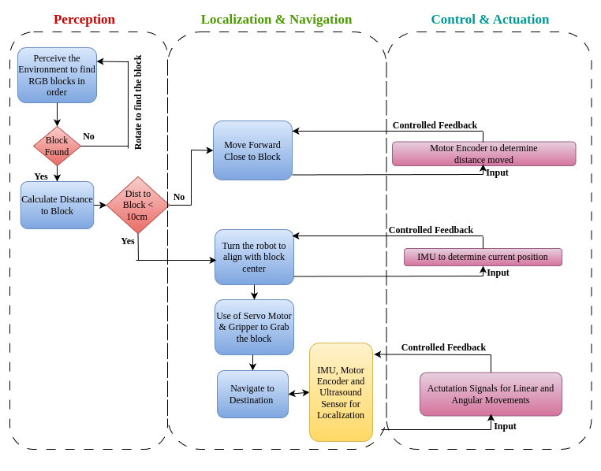

# Autonomous Robotics - ENPM809T

## Introduction

ENPM809T - Autonomous Robotics at the University of Maryland, College Park, provides a comprehensive hands-on experience in robotics. Throughout this course, we focus on key robotic concepts such as Perception, Planning, Controls, and Modeling to build a fully functional autonomous robot. The culmination of our efforts is demonstrated in a final challenge where the robot performs tasks typical of a construction zone environment.

## Course Challenge

The final challenge involves the robot autonomously picking up and placing objects accurately between accurately between a designated start and goal point, simulating a practical application in construction zones. This reduces the workload on human labor and showcases the practical utility of robotic applications.

## Integration Details

The robot integrates various hardware and software components to achieve autonomy:

### Hardware Components

1. **Raspberry Pi and Pi Camera**: Acts as the brain of the robot, providing processing power and vision capabilities.
2. **Ultrasonic Sensor**: For obstacle detection and avoidance.
3. **Magnetic Encoders**: To measure wheel rotation for precise movement control.
4. **H-Bridge**: To control motor directions.
5. **IMU and Arduino Nano**: For orientation and positional data.
6. **Gripper**: To pick up and handle objects.
7. **DC Geared Motors and Wheels**: For mobility.
8. **Chassis (Pirate)**: Supports all hardware components.

### Software Integration

The autonomous operations are driven by a robust software framework, detailed in the process flow diagram below:

  

### Code

The robot's operations in the final challenge are controlled by the script located at `final_code.py`.

## Course Journey Video

Experience our journey through this course, from the initial stages of building the robot to the final challenge, in the video linked below:

https://www.youtube.com/watch?v=4t52yHKE1sg

## Achievements

In the final competition, our robot successfully picked and placed 7 out of 9 RGB blocks, demonstrating effective integration and functionality of the learned concepts.

## Support

For questions or support regarding this project, please open an issue on this repository.

